# 质量检查规范

> 提供高、中、低三档质量检查级别，在代码质量与开发效率之间取得平衡。

## 目录

- [概述](#概述)
- [高级别检查](#高级别检查-high)
- [中级别检查](#中级别检查-medium)
- [低级别检查](#低级别检查-low)
- [级别选择指南](#级别选择指南)
- [自定义配置](#自定义配置)

---

## 概述

### 三档级别定位

| 级别 | 适用场景 | 质量要求 | 开发效率 |
|------|---------|---------|---------|
| **高** | 核心模块、生产代码、多人协作 | 最严格 | 较慢 |
| **中** | 常规功能开发、日常迭代 | 平衡 | 适中 |
| **低** | 原型开发、实验性功能、快速验证 | 宽松 | 最快 |

### 检查维度

所有级别都会检查以下维度，但严格程度不同：

1. **语法检查** - 代码是否有语法错误
2. **格式化** - 代码格式是否统一
3. **代码规范** - 是否符合团队约定
4. **类型检查** - Props/参数类型是否正确
5. **性能优化** - 是否有明显的性能问题
6. **安全性** - 是否存在安全隐患
7. **可维护性** - 代码是否易于理解和修改
8. **测试覆盖** - 是否需要测试

---

## 与配置文件的映射（可复制）

为便于快速启用不同质量级别，以下示例与 `frontend/rules/quality-level/` 下的配置对应：

```bash
# 高级别（High）
cp frontend/rules/quality-level/high.eslintrc.js .eslintrc.js
cp frontend/rules/quality-level/high.tsconfig.json tsconfig.json

# 中级别（Medium）
cp frontend/rules/quality-level/medium.eslintrc.js .eslintrc.js
cp frontend/rules/quality-level/medium.tsconfig.json tsconfig.json

# 低级别（Low）
cp frontend/rules/quality-level/low.eslintrc.js .eslintrc.js
cp frontend/rules/quality-level/low.tsconfig.json tsconfig.json
```

建议在高/中级别中额外启用：`eslint-plugin-jsx-a11y`，并在组件库内默认遵循 a11y 规范。

---

## 按级别的测试与 a11y 最低要求

- 高（High）
  - 测试：关键路径用例（组件/Hook/API），包含加载/空/错误三态；基础 a11y 断言（如无可聚焦陷阱、aria 属性存在）。
  - 工具：Vitest + React Testing Library（RTL）。
  - Lint：开启 `eslint-plugin-jsx-a11y` 严格规则。

- 中（Medium）
  - 测试：新组件冒烟测试（可渲染、基本交互）。
  - Lint：启用 `eslint-plugin-jsx-a11y` 的推荐规则。

- 低（Low）
  - 测试：可选；建议至少保留渲染冒烟测试。
  - Lint：a11y 可选。

示例（RTL）
```tsx
import { render, screen } from '@testing-library/react'
import UserCard from './index'

it('renders name in user card', () => {
  render(<UserCard user={{ id: 1, name: 'Alice' }} />)
  expect(screen.getByText('Alice')).toBeInTheDocument()
})
```

---

## 性能指标（Core Web Vitals）建议阈值

- LCP：≤ 2.5s（高），≤ 3.0s（中），≤ 3.5s（低）
- CLS：≤ 0.1（高/中），≤ 0.15（低）
- INP：≤ 200ms（高），≤ 300ms（中），≤ 400ms（低）

执行建议：
- 高：对关键路径设性能预算（体积、请求数、首屏渲染）。
- 中：关注首屏资源体积与懒加载。
- 低：容忍度更高，但避免明显卡顿与抖动。

## 高级别检查 (High)

> 适用于核心模块、生产环境代码、多人协作项目

### 检查项清单

#### 1. 语法和格式 ✅ 必须通过

- [x] ESLint 检查通过，无任何警告和错误
- [x] Prettier 格式化通过
- [x] 不能有 `console.log`、`debugger` 等调试代码
- [x] 不能有注释掉的代码块

**工具配置：**
```javascript
// .eslintrc.js (高级别)
module.exports = {
  extends: [
    'eslint:recommended',
    'plugin:react/recommended',
    'plugin:react-hooks/recommended',
  ],
  rules: {
    'no-console': 'error', // 禁止 console
    'no-debugger': 'error', // 禁止 debugger
    'no-unused-vars': 'error', // 禁止未使用的变量
    'no-var': 'error', // 禁止使用 var
    'prefer-const': 'error', // 优先使用 const
    'eqeqeq': ['error', 'always'], // 必须使用 ===
    'no-eval': 'error', // 禁止 eval
    'react/prop-types': 'error', // 必须定义 PropTypes
    'react-hooks/rules-of-hooks': 'error',
    'react-hooks/exhaustive-deps': 'error',
  },
}
```

#### 2. 类型和接口 ✅ 必须通过

- [x] 所有组件必须定义 PropTypes（或 TypeScript 类型）
- [x] 所有 API 函数必须有 JSDoc 注释说明参数和返回值
- [x] Context 的 value 必须有类型定义
- [x] 回调函数必须声明参数类型

**示例：**
```jsx
import PropTypes from 'prop-types'

/**
 * 用户卡片组件
 * @component
 */
function UserCard({ user, onEdit, onDelete }) {
  // 组件实现
}

// ✅ 必须：完整的 PropTypes 定义
UserCard.propTypes = {
  user: PropTypes.shape({
    id: PropTypes.number.isRequired,
    name: PropTypes.string.isRequired,
    email: PropTypes.string.isRequired,
    avatar: PropTypes.string,
  }).isRequired,
  onEdit: PropTypes.func,
  onDelete: PropTypes.func,
}

UserCard.defaultProps = {
  onEdit: () => {},
  onDelete: () => {},
}
```

#### 3. 代码规范 ✅ 必须通过

- [x] 组件必须使用文件夹形式（ComponentName/index.jsx）
- [x] CSS 类名必须使用 BEM 规范
- [x] 文件内容超过 200 行需要考虑拆分
- [x] 函数复杂度不超过 15（圈复杂度）
- [x] 嵌套层级不超过 4 层
- [x] 单个函数长度不超过 50 行

**检查工具：**
```javascript
// ESLint 配置中添加
rules: {
  'complexity': ['error', 15], // 最大圈复杂度
  'max-depth': ['error', 4], // 最大嵌套层级
  'max-lines-per-function': ['error', { max: 50, skipBlankLines: true }],
}
```

#### 4. 文档注释 ✅ 必须通过

- [x] 所有导出的函数/组件必须有 JSDoc 注释
- [x] 复杂组件（20+ 行或有内部状态）必须有 README.md
- [x] 复杂业务逻辑必须有行内注释说明
- [x] TODO/FIXME 必须注明负责人和日期

**示例：**
```javascript
/**
 * 格式化货币显示
 * @param {number} amount - 金额（单位：分）
 * @param {string} [currency='CNY'] - 货币类型
 * @returns {string} 格式化后的货币字符串
 * @example
 * formatCurrency(12345) // => '¥123.45'
 * formatCurrency(12345, 'USD') // => '$123.45'
 */
export function formatCurrency(amount, currency = 'CNY') {
  // 实现...
}

// TODO: 添加多语言支持 - 张三 2024-01-15
```

#### 5. 性能优化 ⚠️ 强烈建议

- [x] 列表渲染必须使用稳定的 key
- [x] 大型列表（100+ 项）应考虑虚拟滚动
- [x] 事件处理函数应使用 useCallback
- [x] 计算密集型操作应使用 useMemo
- [x] 避免在循环中创建新对象/函数
- [x] 图片必须添加懒加载（可见区域外）

**示例：**
```jsx
function UserList({ users, onUserClick }) {
  // ✅ 使用 useCallback 缓存事件处理
  const handleClick = useCallback((userId) => {
    onUserClick?.(userId)
  }, [onUserClick])

  // ✅ 使用 useMemo 缓存计算结果
  const filteredUsers = useMemo(() => {
    return users.filter(user => user.isActive)
  }, [users])

  return (
    <div>
      {filteredUsers.map(user => (
        // ✅ 使用稳定的 key
        <UserCard
          key={user.id}
          user={user}
          onClick={handleClick}
        />
      ))}
    </div>
  )
}
```

#### 6. 错误处理 ✅ 必须通过

- [x] 所有 API 请求必须有 try-catch 或 .catch()
- [x] 错误信息必须用户友好（不能直接显示技术错误）
- [x] 异步操作必须有 loading 状态
- [x] 必须处理边界情况（空数据、错误状态等）
- [x] 表单必须有完整的验证逻辑

**示例：**
```jsx
function UserList() {
  const [users, setUsers] = useState([])
  const [loading, setLoading] = useState(false)
  const [error, setError] = useState(null)

  const loadUsers = async () => {
    try {
      setLoading(true)
      setError(null)
      const data = await userAPI.getList()
      setUsers(data)
    } catch (err) {
      // ✅ 用户友好的错误信息
      setError('加载用户列表失败，请稍后重试')
      console.error('Load users failed:', err)
    } finally {
      setLoading(false)
    }
  }

  // ✅ 处理所有状态
  if (loading) return <Spin />
  if (error) return <ErrorMessage message={error} onRetry={loadUsers} />
  if (users.length === 0) return <Empty description="暂无用户数据" />

  return <div>{/* 渲染列表 */}</div>
}
```

#### 7. 安全性 ✅ 必须通过

- [x] 不能有硬编码的密钥、密码、Token
- [x] 用户输入必须经过验证和转义
- [x] 敏感信息不能存储在 localStorage（使用 httpOnly cookie）
- [x] 外部链接必须添加 `rel="noopener noreferrer"`
- [x] dangerouslySetInnerHTML 必须经过严格审查

**示例：**
```jsx
// ❌ 错误：硬编码 API Key
const API_KEY = 'sk-1234567890abcdef'

// ✅ 正确：使用环境变量
const API_KEY = import.meta.env.VITE_API_KEY

// ❌ 错误：直接渲染用户输入
<div>{userInput}</div>

// ✅ 正确：转义用户输入
<div>{escapeHtml(userInput)}</div>

// ✅ 外部链接添加安全属性
<a href={externalUrl} target="_blank" rel="noopener noreferrer">
  链接
</a>
```

#### 8. 可访问性 (A11y) ⚠️ 强烈建议

- [x] 图片必须有 alt 属性
- [x] 表单控件必须有关联的 label
- [x] 按钮必须有清晰的文本或 aria-label
- [x] 可交互元素必须支持键盘操作
- [x] 颜色对比度符合 WCAG AA 标准

**示例：**
```jsx
// ✅ 图片有 alt


// ✅ 表单有 label
<label htmlFor="username">用户名</label>
<input id="username" type="text" />

// ✅ 图标按钮有 aria-label
<button aria-label="删除用户" onClick={handleDelete}>
  <DeleteIcon />
</button>
```

### 检查结果判定

**通过标准：**
- 所有 ✅ 必须通过 项目全部通过
- 所有 ⚠️ 强烈建议 项目至少通过 80%

**不通过：**
- 任何一项 ✅ 必须通过 未通过
- ⚠️ 强烈建议 通过率低于 80%

---

## 中级别检查 (Medium)

> 适用于日常开发、常规功能迭代，平衡质量与效率

### 检查项清单

#### 1. 语法和格式 ✅ 必须通过

- [x] ESLint 检查通过，无错误（允许少量警告）
- [x] Prettier 格式化通过
- [x] 生产环境代码不能有 `console.log`、`debugger`
- [ ] 开发环境允许调试代码（需要注释说明）

**工具配置：**
```javascript
// .eslintrc.js (中级别)
module.exports = {
  extends: ['eslint:recommended', 'plugin:react/recommended'],
  rules: {
    'no-console': 'warn', // 警告而非错误
    'no-debugger': 'error',
    'no-unused-vars': 'warn',
    'no-var': 'error',
    'prefer-const': 'warn',
    'eqeqeq': ['warn', 'always'],
    'react/prop-types': 'warn', // 警告而非错误
    'react-hooks/rules-of-hooks': 'error',
    'react-hooks/exhaustive-deps': 'warn',
  },
}
```

#### 2. 类型和接口 ⚠️ 强烈建议

- [x] 组件建议定义 PropTypes（复杂组件必须）
- [x] API 函数必须有注释说明用途
- [ ] 简单工具函数可以省略详细的 JSDoc
- [ ] 内部使用的组件可以省略 PropTypes

**示例：**
```jsx
// ✅ 对外暴露的组件必须有 PropTypes
export function UserCard({ user, onClick }) {
  // 实现
}

UserCard.propTypes = {
  user: PropTypes.object.isRequired,
  onClick: PropTypes.func,
}

// ✅ 内部组件可以简化
function InternalComponent({ data }) {
  // 实现
}
```

#### 3. 代码规范 ✅ 核心规范必须通过

- [x] 组件必须使用文件夹形式
- [x] CSS 类名使用 kebab-case 或 BEM（保持一致）
- [x] 文件内容超过 300 行建议拆分
- [x] 函数复杂度不超过 20
- [ ] 嵌套层级尽量不超过 5 层
- [ ] 单个函数长度建议不超过 80 行

**检查配置：**
```javascript
rules: {
  'complexity': ['warn', 20],
  'max-depth': ['warn', 5],
  'max-lines-per-function': ['warn', { max: 80 }],
}
```

#### 4. 文档注释 ⚠️ 关键部分必须

- [x] 导出的 API 函数必须有注释
- [x] 复杂组件（50+ 行）建议有 README.md
- [x] 复杂业务逻辑建议有注释
- [ ] 简单组件可以只有顶部注释

**示例：**
```javascript
/**
 * 获取用户列表
 */
export function getUserList(params) {
  return request.get('/users', { params })
}

// 简单组件可以只有简短注释
/**
 * 加载中状态组件
 */
function LoadingSpinner() {
  return <div className="spinner" />
}
```

#### 5. 性能优化 💡 按需优化

- [x] 列表渲染必须使用 key
- [ ] 小型列表（< 50 项）不强制虚拟滚动
- [x] 明显的重复渲染应该优化
- [ ] 事件处理建议使用 useCallback（非强制）
- [ ] 计算操作建议使用 useMemo（非强制）

**示例：**
```jsx
function UserList({ users }) {
  // 💡 小型列表可以不用 useCallback
  const handleClick = (userId) => {
    console.log(userId)
  }

  return (
    <div>
      {users.map(user => (
        // ✅ key 是必须的
        <UserCard key={user.id} user={user} onClick={handleClick} />
      ))}
    </div>
  )
}
```

#### 6. 错误处理 ✅ 基本处理必须

- [x] API 请求必须有错误处理
- [x] 错误信息应该用户友好
- [x] 异步操作建议有 loading 状态
- [ ] 边界情况至少处理主要场景
- [ ] 表单建议有验证（非强制全部字段）

**示例：**
```jsx
function UserList() {
  const [users, setUsers] = useState([])
  const [loading, setLoading] = useState(false)

  const loadUsers = async () => {
    try {
      setLoading(true)
      const data = await userAPI.getList()
      setUsers(data)
    } catch (err) {
      message.error('加载失败')
    } finally {
      setLoading(false)
    }
  }

  // ✅ 基本状态处理
  if (loading) return <div>加载中...</div>

  return <div>{/* 渲染列表 */}</div>
}
```

#### 7. 安全性 ✅ 基本安全必须

- [x] 不能有硬编码的敏感信息
- [x] 用户输入应该验证
- [ ] 敏感信息存储建议使用 cookie
- [x] 外部链接建议添加安全属性

#### 8. 可访问性 💡 基本要求

- [x] 图片建议有 alt 属性
- [ ] 表单控件建议有 label
- [ ] 按钮建议有清晰的文本

### 检查结果判定

**通过标准：**
- 所有 ✅ 必须通过 / 核心规范 全部通过
- ⚠️ 强烈建议 通过率 60% 以上
- 💡 按需优化 项目可忽略

**不通过：**
- 任何 ✅ 必须通过 未通过
- ⚠️ 强烈建议 通过率低于 60%

---

## 低级别检查 (Low)

> 适用于快速原型、实验性功能、概念验证，优先保证功能实现

### 检查项清单

#### 1. 语法和格式 ✅ 基本语法必须

- [x] 代码能够成功构建（无语法错误）
- [x] Prettier 格式化通过
- [ ] 允许 console.log 和调试代码
- [ ] 允许 ESLint 警告

**工具配置：**
```javascript
// .eslintrc.js (低级别)
module.exports = {
  extends: ['eslint:recommended'],
  rules: {
    'no-console': 'off', // 允许 console
    'no-debugger': 'warn', // 仅警告
    'no-unused-vars': 'warn',
    'no-var': 'warn',
    // 其他规则设为 warn 或 off
  },
}
```

#### 2. 类型和接口 💡 可选

- [ ] PropTypes 可选
- [ ] 注释可选
- [ ] 类型检查可选

#### 3. 代码规范 ✅ 基本结构

- [x] 组件应该使用文件夹形式（允许例外）
- [ ] CSS 类名保持基本一致即可
- [ ] 文件长度不限
- [ ] 函数复杂度不限

**示例：**
```jsx
// ✅ 快速实现，不强制完美
function UserList() {
  const [users, setUsers] = useState([])

  useEffect(() => {
    userAPI.getList().then(setUsers)
  }, [])

  return (
    <div>
      {users.map((u, i) => (
        // 允许使用 index 作为 key（仅在无唯一 ID 时）
        <div key={i}>{u.name}</div>
      ))}
    </div>
  )
}
```

#### 4. 文档注释 💡 可选

- [ ] 注释可选
- [ ] README 可选
- [ ] 建议添加 TODO 标记后续完善

**示例：**
```jsx
// TODO: 后续添加错误处理和 loading 状态
function UserList() {
  const [users, setUsers] = useState([])
  useEffect(() => {
    fetch('/api/users')
      .then(res => res.json())
      .then(setUsers)
  }, [])
  return <div>{/* 渲染 */}</div>
}
```

#### 5. 性能优化 💡 不强制

- [x] 列表渲染建议使用 key（可以用 index）
- [ ] 其他性能优化均不强制

#### 6. 错误处理 ⚠️ 建议基本处理

- [x] API 请求建议有 .catch() 或 try-catch
- [ ] 错误提示可简化
- [ ] loading 状态可选
- [ ] 边界情况可后续处理

**示例：**
```jsx
function UserList() {
  const [users, setUsers] = useState([])

  useEffect(() => {
    userAPI.getList()
      .then(setUsers)
      .catch(err => console.error(err)) // 简单的错误处理
  }, [])

  return <div>{/* 渲染 */}</div>
}
```

#### 7. 安全性 ✅ 最低要求

- [x] 不能有明显的安全漏洞（SQL 注入、XSS 等）
- [x] 敏感信息不能硬编码
- [ ] 其他安全措施可后续完善

#### 8. 可访问性 💡 可选

- [ ] 所有可访问性要求均可选

### 检查结果判定

**通过标准：**
- ✅ 基本语法必须 通过
- ✅ 最低安全要求 通过
- 代码能够运行，实现基本功能

**不通过：**
- 有语法错误，无法构建
- 有明显的安全漏洞

---

## 级别选择指南

### 场景匹配表

| 场景 | 推荐级别 | 理由 |
|------|---------|------|
| 生产环境核心功能 | 高 | 影响用户体验和业务流程 |
| 公共组件库 | 高 | 被多处引用，影响范围大 |
| 用户认证/支付模块 | 高 | 涉及安全和资金 |
| 常规业务功能 | 中 | 平衡质量和效率 |
| 后台管理页面 | 中 | 用户量小，可容忍小问题 |
| 数据展示页面 | 中 | 逻辑相对简单 |
| 快速原型验证 | 低 | 优先验证想法 |
| 实验性功能 | 低 | 可能会废弃，不值得高投入 |
| 临时页面/活动页 | 低 | 短期使用，优先上线 |

### 项目阶段建议

```mermaid
graph LR
    A[项目启动] --> B[原型阶段: 低]
    B --> C[MVP 开发: 低→中]
    C --> D[正式上线: 中→高]
    D --> E[稳定运营: 高]
```



1. **原型阶段**：低级别，快速验证
2. **MVP 开发**：从低到中，逐步完善
3. **正式上线**：中到高级别，确保质量
4. **稳定运营**：高级别，持续维护

### 动态调整策略

**升级触发条件：**
- 功能从实验转为正式
- 用户量大幅增长
- 发现多个 Bug
- 需要多人协作

**降级触发条件：**
- 紧急需求，时间紧迫
- 临时性活动页面
- 概念验证代码

---

## 自定义配置

### 配置文件结构

```javascript
// .quality-check.config.js
export default {
  // 默认级别
  defaultLevel: 'medium',

  // 按路径自定义级别
  pathRules: {
    'src/components/**': 'high',      // 全局组件高标准
    'src/pages/admin/**': 'medium',   // 管理页面中标准
    'src/pages/prototype/**': 'low',  // 原型页面低标准
  },

  // 按文件类型自定义
  fileTypeRules: {
    '**/*Context.jsx': 'high',        // Context 高标准
    '**/*test.js': 'medium',          // 测试文件中标准
  },

  // 自定义检查项
  customRules: {
    high: {
      // 在高级别基础上添加自定义规则
      requireReadme: true,
      maxFileLines: 200,
      requireTests: true,
    },
    medium: {
      maxFileLines: 300,
      requireTests: false,
    },
    low: {
      maxFileLines: null, // 不限制
    },
  },

  // 忽略特定文件
  ignore: [
    'src/legacy/**',
    '**/*.generated.js',
  ],
}
```

### 使用示例

```javascript
// 在代码生成时读取配置
import qualityCheckConfig from './.quality-check.config.js'

function getQualityLevel(filePath) {
  // 检查路径规则
  for (const [pattern, level] of Object.entries(qualityCheckConfig.pathRules)) {
    if (minimatch(filePath, pattern)) {
      return level
    }
  }

  // 检查文件类型规则
  for (const [pattern, level] of Object.entries(qualityCheckConfig.fileTypeRules)) {
    if (minimatch(filePath, pattern)) {
      return level
    }
  }

  // 返回默认级别
  return qualityCheckConfig.defaultLevel
}
```

---

## 检查工具集成

### 1. ESLint 配置

根据级别使用不同的 ESLint 配置：

```javascript
// scripts/check-quality.js
const qualityLevel = process.env.QUALITY_LEVEL || 'medium'

const eslintConfig = {
  high: '.eslintrc.high.js',
  medium: '.eslintrc.medium.js',
  low: '.eslintrc.low.js',
}

// 运行 ESLint
exec(`eslint --config ${eslintConfig[qualityLevel]} src/`)
```

### 2. 构建前检查

```javascript
// vite.config.js
export default {
  plugins: [
    react(),
    {
      name: 'quality-check',
      enforce: 'pre',
      apply: 'build',
      buildStart() {
        // 生产环境构建时强制使用高级别检查
        const level = process.env.NODE_ENV === 'production' ? 'high' : 'medium'
        console.log(`Quality check level: ${level}`)
        // 执行检查...
      },
    },
  ],
}
```

### 3. Git Hooks 集成

```javascript
// .husky/pre-commit
#!/bin/sh

# 获取修改的文件
files=$(git diff --cached --name-only --diff-filter=ACM | grep '\.jsx\?$')

# 根据文件路径确定检查级别
for file in $files; do
  level=$(node scripts/get-quality-level.js "$file")
  echo "Checking $file with level: $level"
  node scripts/quality-check.js "$file" "$level"
done
```

---

## 质量检查报告模板

### 高级别报告

```markdown
# 质量检查报告 - 高级别

## 文件信息
- 路径：src/components/UserCard/index.jsx
- 级别：High
- 检查时间：2024-01-15 14:30:00

## 检查结果：✅ 通过

### 语法和格式 ✅
- [x] ESLint: 0 errors, 0 warnings
- [x] Prettier: 已格式化
- [x] 无调试代码

### 类型和接口 ✅
- [x] PropTypes 完整定义
- [x] JSDoc 注释完整

### 代码规范 ✅
- [x] 文件夹形式
- [x] BEM 命名
- [x] 文件长度: 120 行 (< 200)
- [x] 圈复杂度: 8 (< 15)

### 文档 ✅
- [x] JSDoc 完整
- [x] README.md 存在

### 性能 ✅
- [x] 使用 useCallback
- [x] 使用 useMemo
- [x] 正确的 key

### 错误处理 ✅
- [x] 完整的错误处理
- [x] Loading 状态
- [x] 边界情况处理

### 安全性 ✅
- [x] 无硬编码敏感信息
- [x] 用户输入验证

### 可访问性 ✅
- [x] Alt 属性
- [x] ARIA 标签
- [x] 键盘支持

## 总结
代码质量优秀，符合高级别标准，可以合并到生产代码。

## 建议
无
```

### 中级别报告

```markdown
# 质量检查报告 - 中级别

## 文件信息
- 路径：src/pages/Dashboard/index.jsx
- 级别：Medium
- 检查时间：2024-01-15 14:30:00

## 检查结果：✅ 通过（3 个建议）

### 必须项 ✅
- [x] 语法检查通过
- [x] 格式化通过
- [x] 基本规范符合

### 建议项 ⚠️
- [x] PropTypes 已定义
- [ ] 建议添加 useCallback 优化性能
- [ ] 建议添加图片 alt 属性

### 可选项 💡
- [x] 注释较为完整
- [ ] 可以考虑拆分子组件

## 总结
代码质量良好，符合中级别标准，可以继续开发。

## 建议
1. 添加 useCallback 优化事件处理函数（非阻塞）
2. 为图片添加 alt 属性以改善可访问性
```

### 低级别报告

```markdown
# 质量检查报告 - 低级别

## 文件信息
- 路径：src/pages/Prototype/TestPage.jsx
- 级别：Low
- 检查时间：2024-01-15 14:30:00

## 检查结果：✅ 通过

### 基本检查 ✅
- [x] 代码可以构建
- [x] 无明显安全漏洞
- [x] 基本功能实现

## 总结
代码可以运行，满足原型开发需求。

## 后续优化建议
- 添加错误处理
- 添加 PropTypes
- 完善注释
- 优化性能

标记为 TODO，后续转为正式功能时提升检查级别到 Medium。
```

---

## 总结

### 三档级别对比

| 检查维度 | 高级别 | 中级别 | 低级别 |
|---------|-------|-------|-------|
| 语法检查 | 0 错误 0 警告 | 0 错误少量警告 | 可构建即可 |
| 类型定义 | 必须 | 复杂组件必须 | 可选 |
| 代码规范 | 严格执行 | 核心规范 | 基本结构 |
| 文档注释 | 完整文档 | 关键部分 | 可选 |
| 性能优化 | 全面优化 | 明显问题 | 不强制 |
| 错误处理 | 全面处理 | 基本处理 | 建议处理 |
| 安全性 | 严格检查 | 基本安全 | 最低要求 |
| 可访问性 | 全面支持 | 基本要求 | 可选 |

### 使用建议

1. **默认使用中级别**，适合大多数场景
2. **核心模块升级到高级别**，确保质量
3. **原型阶段使用低级别**，快速验证
4. **根据项目阶段动态调整**，持续优化

---

**下一步：** 阅读 [03-生成流程与用户交互](./03-workflow.md) 了解代码生成的完整流程。