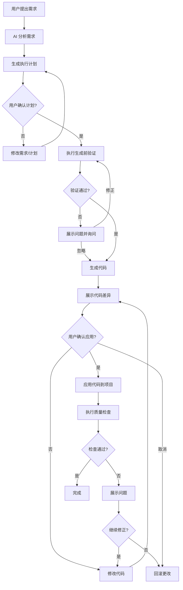

# 生成流程与用户交互

> 定义清晰的代码生成流程，确保用户对 AI 生成代码有充分的审查和控制权。

## 目录

- [核心原则](#核心原则)
- [完整流程](#完整流程)
- [分步详解](#分步详解)
- [交互模式](#交互模式)
- [回滚机制](#回滚机制)
- [最佳实践](#最佳实践)

---

## 核心原则

### 1. 透明度
- 用户能够清楚地看到 AI 将要生成什么代码
- 生成前展示完整的计划和文件清单
- 提供代码差异对比

### 2. 可控性
- 关键节点需要用户确认
- 支持分步执行，而非一次性生成所有代码
- 允许中断和修改计划

### 3. 可回滚
- 支持撤销操作
- 保留历史版本
- 提供恢复机制

### 4. 渐进式
- 从计划到实现分步进行
- 先生成核心代码，再完善细节
- 支持增量修改而非全量重写

---

## 设计到代码（预步骤）

在生成任何代码前，建议补充以下设计上下文以减少返工：
- 设计 Token：颜色、字号、间距、圆角、阴影、动效时长。
- 组件清单：优先复用现有组件，避免重复造轮子。
- 交互草图：状态流转（加载/空/错误/禁用/悬浮/聚焦）。
- 可达性要求：键盘流程、读屏标题、焦点管理与逃逸。

> 若无设计文件，请至少提供 Token 与组件清单的文本版本。

---

## 完整流程



---

## 分步详解

### 第一步：需求分析

**目标：** 充分理解用户需求，明确生成目标

#### AI 应该做的事情

1. **分析需求关键信息**
   - 功能描述
   - 技术约束
   - 质量要求
   - 时间优先级

2. **识别不明确的部分**
   - 缺少必要信息时主动询问
   - 提供选项让用户选择

3. **确认上下文**
   - 项目类型（单人/小组）
   - 质量级别（高/中/低）
   - 相关现有代码

#### 交互示例

```markdown
🤖 AI: 我理解您想要创建一个用户列表组件。为了更好地生成代码，请确认以下信息：

1. **数据来源**
   - [ ] 从 API 获取
   - [ ] 通过 Props 传入
   - [ ] 使用 Context

2. **功能需求**（请勾选需要的功能）
   - [ ] 分页
   - [ ] 搜索过滤
   - [ ] 排序
   - [ ] 单选/多选

3. **质量级别**
   - [ ] 高（完整错误处理、性能优化、文档）
   - [ ] 中（基本错误处理、常规性能）
   - [ ] 低（快速实现，后续完善）

请回复您的选择，或直接说"使用默认配置"。
```

---

### 第二步：生成执行计划

**目标：** 明确要创建/修改哪些文件，每个文件的职责

#### 计划内容结构

```markdown
# 代码生成计划

## 概述
创建用户列表组件，支持数据获取、展示和搜索功能。

## 文件清单

### 新建文件
1. **src/pages/UserManagement/components/UserList/index.jsx**
   - 用户列表主组件
   - 包含数据获取、搜索、列表渲染

2. **src/pages/UserManagement/components/UserList/styles.css**
   - 组件样式
   - 使用 BEM 命名规范

3. **src/pages/UserManagement/components/UserList/README.md**
   - 组件文档（质量级别：高）

### 修改文件
1. **src/pages/UserManagement/index.jsx**
   - 添加 UserList 组件引用

2. **src/api/user.js**
   - 添加 getUserList 接口（如果不存在）

## 依赖项
- axios: ✅ 已安装
- react: ✅ 已安装

## 预计影响
- 新增代码：约 150 行
- 修改代码：约 10 行
- 风险评估：低（新增功能，不影响现有代码）

## 验证检查
- [x] 路径验证通过
- [x] 命名验证通过
- [x] 无依赖缺失
- [x] 无文件冲突

## 质量检查级别
中级别（Medium）

---

请确认此计划，或提出修改意见：
- 回复 "确认" 继续执行
- 回复 "修改 [具体内容]" 调整计划
- 回复 "取消" 终止操作
```

---

### 第三步：生成前验证

**目标：** 在生成代码前执行自动化检查，避免明显错误

#### 验证项目（参考 01-prompt-and-standards.md 第四部分）

1. **路径验证** - 文件路径是否符合规范
2. **命名验证** - 组件/文件命名是否正确
3. **依赖检查** - 所需依赖是否已安装
4. **冲突检测** - 是否与现有代码冲突

#### 验证报告示例

```markdown
# 🔍 生成前验证报告

## ✅ 验证通过

### 路径验证
- [x] src/pages/UserManagement/components/UserList/index.jsx
- [x] 符合页面组件规范

### 命名验证
- [x] UserList (PascalCase)
- [x] user-list (CSS class, kebab-case)

### 依赖检查
- [x] 所有依赖已安装

### 冲突检测
- [x] 无文件冲突
- [x] 无组件名冲突

---

验证通过，可以继续生成代码。按 Enter 继续...
```

#### 验证失败处理

```markdown
# ⚠️ 生成前验证发现问题

## 问题 1：文件已存在
文件：src/api/user.js
该文件已存在，包含其他 API 函数。

**处理方案（请选择）：**
1. 在现有文件末尾追加新函数
2. 跳过此文件，手动添加
3. 查看现有文件内容再决定

## 问题 2：依赖缺失
缺少：lodash.debounce
用途：搜索防抖功能

**处理方案（请选择）：**
1. 自动安装依赖（推荐）
   ```bash
   pnpm install lodash.debounce
   ```
2. 使用原生实现（不安装依赖）
3. 暂不实现防抖功能

---

请回复您的选择（如：1-1, 2-2）：
```

---

### 第二步·补充：RFC-lite（可选，≤10 条）

用于非小改动前的快速评审：
1. 背景与目标：
2. 方案概述：
3. 文件/模块影响：
4. 数据与状态流：
5. 无障碍与 i18n：
6. 性能与安全：
7. 风险与替代：
8. 迁移与回滚：
9. 度量指标：
10. 未决问题：

---

### 第四步：生成代码

**目标：** 生成符合规范的代码

#### 分步生成策略

**策略 1：一次性生成（适合简单任务）**
```markdown
✅ 所有文件一次性生成完毕

生成文件：
- src/pages/UserManagement/components/UserList/index.jsx (120 行)
- src/pages/UserManagement/components/UserList/styles.css (45 行)
- src/pages/UserManagement/components/UserList/README.md (80 行)

修改文件：
- src/pages/UserManagement/index.jsx (+5 行)
```

**策略 2：分步生成（适合复杂任务）**
```markdown
📝 分步生成计划（共 4 步）

第 1 步：创建基础组件结构
- UserList/index.jsx（基本框架）
- UserList/styles.css（基本样式）

第 2 步：实现数据获取
- 添加 API 请求逻辑
- 添加 loading 和 error 状态

第 3 步：实现搜索功能
- 添加搜索输入框
- 实现防抖和过滤

第 4 步：完善文档和优化
- 编写 README.md
- 性能优化（useMemo, useCallback）

---

回复 "继续" 开始第 1 步，或 "全部生成" 一次完成所有步骤。
```

---

### 第五步：代码预览（Diff）

**目标：** 让用户清楚地看到将要发生的更改

#### Diff 展示格式

**新建文件：**
```markdown
## 📄 新建文件：src/pages/UserManagement/components/UserList/index.jsx

```jsx
import { useState, useEffect } from 'react'
import { userAPI } from '../../../../api/user'
import './styles.css'

function UserList() {
  const [users, setUsers] = useState([])
  const [loading, setLoading] = useState(false)

  // ... 完整代码
}

export default UserList
```

**文件统计：**
- 总行数：120
- 导入：3
- 组件：1
- Hooks：3 (useState, useEffect, useCallback)

---

查看完整代码？[Y/n]
```

**修改现有文件：**
```diff
## 📝 修改文件：src/pages/UserManagement/index.jsx

--- 原内容
+++ 新内容
@@ -1,10 +1,12 @@
 import { useState } from 'react'
+import UserList from './components/UserList'
 import './styles.css'

 function UserManagement() {
   return (
     <div className="user-management">
       <h1>用户管理</h1>
+      <UserList />
     </div>
   )
 }
```

**交互选项：**
```markdown
请选择操作：
1. 应用所有更改
2. 逐个文件确认
3. 修改代码后再应用
4. 取消操作

回复数字或命令：
```

---

### 第六步：应用代码

**目标：** 将代码写入文件系统

#### 安全应用策略

**备份机制：**
```markdown
📦 应用代码前备份

备份位置：.ai-backup/2024-01-15-143022/
备份文件：
- src/pages/UserManagement/index.jsx.backup

如需回滚，运行：
```bash
npm run ai:rollback 2024-01-15-143022
```

---

开始应用代码...
```

**应用过程：**
```markdown
✅ 创建 src/pages/UserManagement/components/UserList/index.jsx
✅ 创建 src/pages/UserManagement/components/UserList/styles.css
✅ 创建 src/pages/UserManagement/components/UserList/README.md
✅ 修改 src/pages/UserManagement/index.jsx

🎉 代码已成功应用！

接下来进行质量检查...
```

---

### 第七步：质量检查

**目标：** 确保生成的代码符合质量标准（参考 02-quality-check.md）

#### 检查流程

```markdown
🔍 执行质量检查（级别：中）

[1/4] 运行 ESLint...
✅ ESLint 检查通过（0 errors, 2 warnings）

[2/4] 运行 Prettier...
✅ 代码格式正确

[3/4] 检查代码规范...
✅ 组件结构符合规范
⚠️ 建议：添加 PropTypes（非阻塞）

[4/4] 运行构建测试...
✅ 构建成功

---

质量检查结果：✅ 通过
```

#### 检查失败处理

```markdown
❌ 质量检查未通过

### 问题列表

1. **ESLint 错误**
   文件：UserList/index.jsx:15
   错误：Unexpected console statement (no-console)
   ```javascript
   15 | console.log('Users loaded:', users)
   ```
   **建议：** 移除或改为条件日志

2. **类型检查**
   警告：UserList 组件缺少 PropTypes
   **建议：** 添加 PropTypes 定义（质量级别要求）

---

**处理方案：**
1. 自动修复（推荐）- AI 自动修正这些问题
2. 手动修复 - 展示问题，由您手动修改
3. 忽略继续 - 接受当前代码（不推荐）
4. 回滚更改 - 撤销所有更改

请选择（1-4）：
```

---

## 交互模式

### 模式 1：完全交互模式（推荐）

**适用场景：** 重要功能、核心模块、学习阶段

**特点：** 每个关键步骤都需要用户确认

```markdown
完全交互模式启用 ✓

流程：
需求分析 → [确认] →
生成计划 → [确认] →
生成前验证 → [确认] →
生成代码 → [预览] →
应用代码 → [确认] →
质量检查 → [确认] →
完成
```

### 模式 2：半自动模式

**适用场景：** 常规开发、熟悉流程后

**特点：** 关键节点确认，其他自动执行

```markdown
半自动模式启用 ✓

需要确认的节点：
- 生成计划
- 代码预览（Diff）
- 质量检查结果

自动执行：
- 需求分析
- 生成前验证
- 应用代码
```

### 模式 3：自动模式（谨慎使用）

**适用场景：** 简单任务、紧急情况、高度信任

**特点：** 全自动执行，仅在出错时中断

```markdown
⚠️ 自动模式启用

将自动执行所有步骤，仅在以下情况中断：
- 验证失败
- 质量检查严重问题
- 构建失败

随时按 Ctrl+C 中断

开始执行...
```

### 模式选择建议

| 项目类型 | 代码类型 | 推荐模式 |
|---------|---------|---------|
| 单人项目 | 新功能 | 半自动 |
| 单人项目 | 原型 | 自动 |
| 小组项目 | 核心模块 | 完全交互 |
| 小组项目 | 常规功能 | 半自动 |
| 学习阶段 | 所有 | 完全交互 |

---

## 回滚机制

### 回滚场景

1. **用户主动回滚** - 发现生成的代码有问题
2. **质量检查失败** - 严重问题导致自动回滚
3. **构建失败** - 生成的代码无法构建
4. **误操作** - 操作失误需要撤销

### 回滚级别

#### 级别 1：单文件回滚

```markdown
🔄 回滚单个文件

文件：src/pages/UserManagement/components/UserList/index.jsx

操作：
- 删除新建的文件
- 或恢复到备份版本

确认回滚此文件？[Y/n]
```

#### 级别 2：批量回滚

```markdown
🔄 回滚本次操作的所有更改

将回滚以下文件：
- src/pages/UserManagement/components/UserList/index.jsx (删除)
- src/pages/UserManagement/components/UserList/styles.css (删除)
- src/pages/UserManagement/components/UserList/README.md (删除)
- src/pages/UserManagement/index.jsx (恢复到原版本)

确认回滚所有更改？[Y/n]
```

#### 级别 3：历史版本回滚

```markdown
📜 查看历史版本

可用的备份：
1. 2024-01-15 14:30:22 - 创建 UserList 组件
2. 2024-01-15 13:15:10 - 添加用户搜索功能
3. 2024-01-15 10:20:05 - 重构 API 请求层

选择要回滚到的版本（1-3），或输入 'q' 取消：
```

### 回滚实现

```javascript
// 备份结构
.ai-backup/
├── 2024-01-15-143022/
│   ├── manifest.json          // 操作清单
│   └── files/
│       └── src/pages/UserManagement/index.jsx.backup
└── 2024-01-15-131510/
    └── ...

// manifest.json 示例
{
  "timestamp": "2024-01-15T14:30:22.000Z",
  "operation": "create-component",
  "description": "创建 UserList 组件",
  "files": {
    "created": [
      "src/pages/UserManagement/components/UserList/index.jsx",
      "src/pages/UserManagement/components/UserList/styles.css"
    ],
    "modified": [
      {
        "path": "src/pages/UserManagement/index.jsx",
        "backup": ".ai-backup/2024-01-15-143022/files/src/pages/UserManagement/index.jsx.backup"
      }
    ]
  }
}
```

#### 常用 Git 回滚命令

```bash
# 丢弃未提交修改
git restore .

# 撤销最后一次 commit（保留工作区）
git reset --soft HEAD~1

# 回退到某提交（保留工作区改动）
git reset --mixed <commit>

# 创建回滚提交（安全、可追踪）
git revert <commit>
```

---

## 安全检查点

- 秘钥与凭证：不入库；使用环境变量与后端代理。
- 用户数据：最小化采集，避免日志输出 PII。
- DOM 注入：禁止 `dangerouslySetInnerHTML`（除非严格转义与审查）。
- CSP 与外链：外链添加 `rel="noopener noreferrer"`；遵守 CSP 策略。
- 存储策略：敏感信息不用 `localStorage`；优先 httpOnly cookie。

---

## 最佳实践

### 1. 需求描述建议

**✅ 好的需求描述：**
```markdown
创建一个用户列表组件：
- 位置：用户管理页面
- 功能：展示用户列表、支持搜索（按姓名/邮箱）
- 数据源：API (/api/users)
- 样式：参考现有的 ProductList 组件
- 质量级别：中
```

**❌ 不好的需求描述：**
```markdown
做一个列表
```

### 2. 确认节点建议

**必须确认：**
- 生成计划（确保理解需求）
- 代码预览（确保代码正确）
- 破坏性操作（删除/覆盖文件）

**可以跳过确认：**
- 生成前验证（如果都通过）
- 质量检查（如果都通过）
- 格式化操作

### 3. 分步执行建议

**建议分步的场景：**
- 复杂功能（涉及 5+ 文件）
- 不确定的需求（可能需要调整）
- 学习过程（了解每一步做什么）

**可以一次性的场景：**
- 简单组件（1-2 个文件）
- 明确的需求（无歧义）
- 紧急任务（时间优先）

### 4. 错误处理建议

**遇到错误时：**
1. **先看懂错误信息**
   - ESLint 错误：代码规范问题
   - 构建错误：语法或依赖问题
   - 运行时错误：逻辑问题

2. **选择合适的修复方式**
   - 自动修复：格式、简单规范问题
   - AI 辅助修复：逻辑问题
   - 手动修复：复杂业务逻辑

3. **避免重复错误**
   - 更新 Prompt 模板
   - 调整规范配置
   - 记录特殊情况

---

## 流程优化建议

### 提速技巧

1. **使用半自动模式** - 减少不必要的确认
2. **提供详细的初始需求** - 减少来回询问
3. **复用成功的 Prompt** - 建立模板库
4. **定期清理备份** - 保持项目整洁

### 质量保证

1. **重要功能使用完全交互模式** - 确保每一步正确
2. **设置合适的质量级别** - 平衡质量和效率
3. **定期 Review 生成的代码** - 发现模式问题
4. **更新规范文档** - 让 AI 学习项目特点

---

## 总结

### 流程要点

```
清晰的需求 → 完整的计划 → 严格的验证 →
可预览的代码 → 安全的应用 → 全面的检查 →
可靠的回滚
```

### 核心价值

- **透明度**：用户始终知道 AI 在做什么
- **可控性**：关键决策由用户做出
- **安全性**：支持回滚，降低风险
- **效率**：自动化重复工作，聚焦创意

---

**下一步：** 阅读 [04-模板库与范例](./04-templates.md) 查看实用的代码模板。